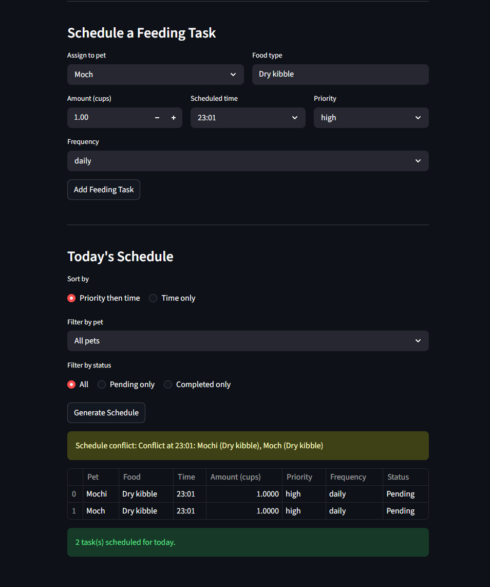

# PawPal+ (Module 2 Project)

You are building **PawPal+**, a Streamlit app that helps a pet owner plan care tasks for their pet.

## Scenario

A busy pet owner needs help staying consistent with pet care. They want an assistant that can:

- Track pet care tasks (walks, feeding, meds, enrichment, grooming, etc.)
- Consider constraints (time available, priority, owner preferences)
- Produce a daily plan and explain why it chose that plan

Your job is to design the system first (UML), then implement the logic in Python, then connect it to the Streamlit UI.

## What you will build

Your final app should:

- Let a user enter basic owner + pet info
- Let a user add/edit tasks (duration + priority at minimum)
- Generate a daily schedule/plan based on constraints and priorities
- Display the plan clearly (and ideally explain the reasoning)
- Include tests for the most important scheduling behaviors

## Getting started

### Setup

```bash
python -m venv .venv
source .venv/bin/activate  # Windows: .venv\Scripts\activate
pip install -r requirements.txt
```

### Suggested workflow

1. Read the scenario carefully and identify requirements and edge cases.
2. Draft a UML diagram (classes, attributes, methods, relationships).
3. Convert UML into Python class stubs (no logic yet).
4. Implement scheduling logic in small increments.
5. Add tests to verify key behaviors.
6. Connect your logic to the Streamlit UI in `app.py`.
7. Refine UML so it matches what you actually built.

#### Smarter Scheduling

- Priority first ordering- tasks that are the highest priority will always rank first in the schedule no matter what.

- Time Based view- allows users to view the tasks by their timestamp that looks at the soonest task first.

- Filtering- allows users to see what tasks has been done, what tasks are pending, and what any specific pet needs.

- Conflict Detection- detects any tasks across all the pets that share the same time slot. Prints a message instead of crashing the program.

- Auto Rescheduling- Marks tasks done and automatically adds the next occurance to the pets schedule.

#### Testing Pawpal+

python -m pytest

- test_mark_complete_changes_status- a fresh task starts as not completed, and calling mark_complete() flips it to True.

- test_add_feeding_increases_task_count- each call to add_feeding() grows the pet's feeding schedule by exactly one.

- test_sort_by_time_orders_chronologically- tasks added out of order come out in ascending time order after sort_by_time().

- test_sort_by_time_empty_list_returns_empty- passing an empty list to sort_by_time() returns an empty list without crashing.

- test_sort_by_time_does_not_consider_priority- a low priority task scheduled earlier sorts before a high priority task scheduled later.

- test_build_schedule_priority_order- build_schedule() puts high before medium before low regardless of insertion order.

- test_build_schedule_empty_pet_returns_empty- pets with no tasks produce an empty schedule without errors.

- test_complete_task_creates_next_day_occurrence- completing a daily task marks it done and creates a new task scheduled for tomorrow.

- test_complete_weekly_task_creates_occurrence_seven_days_later- completing a weekly task creates a new task exactly 7 days later.

- test_complete_once_task_does_not_create_new_task- completing a once task returns None and does not add anything new to the schedule.

- test_filter_tasks_no_filters_returns_all- calling filter_tasks() with no arguments returns every task from all pets.

- test_filter_tasks_all_completed- when every task is marked done, filtering for pending tasks returns an empty list.

- test_filter_tasks_unknown_pet_name_returns_empty- filtering by a pet name that does not exist returns an empty list silently.

- test_detect_conflicts_flags_same_time- two pets with tasks at the same time produces one warning containing the time and both pet names.

- test_detect_conflicts_no_conflicts_returns_empty- tasks at different times produce no warnings.

- test_detect_conflicts_three_tasks_same_time- three pets all scheduled at the same time produces exactly one warning naming all three pets.

- Confidence level- 5 stars

#### Features

- Sorting by time

- Conflict Warnings

- Daily recurrence

- Weekly recurrence

- One-time tasks

- Filter tasks by pet name

- Filter tasks by completion status

- Auto-reschedule on task completion

- Priority-based schedule ordering

- Interactive Streamlit UI for adding pets and tasks

- Sortable and filterable schedule view in the UI

#### Demo


